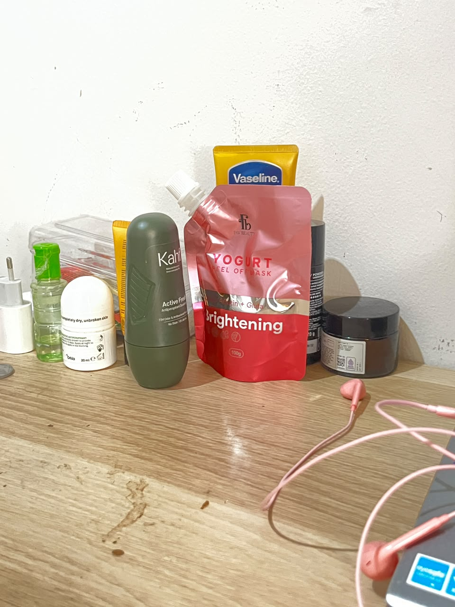
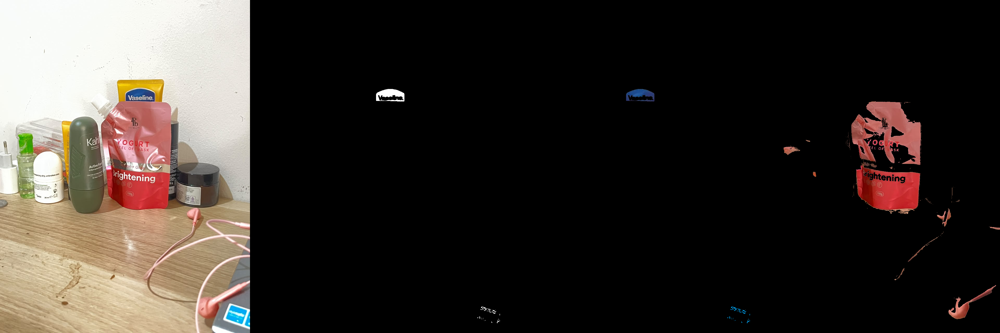
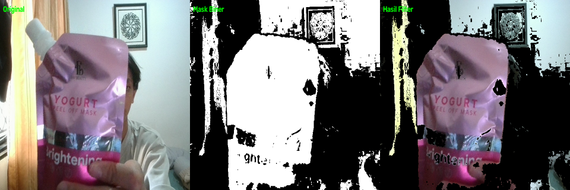

# Laporan Tugas 1: Pengenalan Citra dan Video (Intro)

Mata Kuliah: **Praktikum Pengolahan Citra dan Visi Komputer (PCV)**  
Berkas Program: [`1-Intro.py`](1-Intro.py)

---

## 📌 Ringkasan Tugas
Pada tugas pertama ini, diimplementasikan fungsionalitas dasar pemrosesan citra digital dan streaming video menggunakan pustaka OpenCV dan Python:
1. **Read Image**: Membaca citra dari berkas lokal dan mengekstrak metadatanya.
2. **Show Image**: Menampilkan citra asli ke layar dalam jendela grafis GUI.
3. **Filter Color Image**: Melakukan segmentasi warna tertentu (Biru dan Merah) pada citra diam berbasis ruang warna HSV.
4. **Filter Color Video**: Membaca aliran video webcam secara *real-time*, menyediakan *Trackbar HSV* interaktif untuk tuning warna, serta menyimpan frame hasil saat tombol `'q'` atau `'s'` ditekan.

---

## 🧠 Dasar Teori Singkat

### Mengapa Menggunakan Ruang Warna HSV dibanding RGB/BGR?
Pada ruang warna standar **BGR/RGB**, informasi kromatisitas (warna) dan luminansi (kecerahan/cahaya) saling bercampur pada ketiga kanal ($B, G, R$). Hal ini menyebabkan deteksi warna sangat rentan gagal jika terjadi perubahan pencahayaan, bayangan, atau pantulan cahaya.

Pada ruang warna **HSV**:
- **Hue ($H$)**: Menyatakan jenis warna murni dalam rentang sudut derajat (pada OpenCV diskalakan menjadi $0 - 179$).
- **Saturation ($S$)**: Menyatakan tingkat kemurnian/kepekatan warna ($0 - 255$).
- **Value ($V$)**: Menyatakan tingkat kecerahan/intensitas cahaya ($0 - 255$).

Dengan memisahkan komponen warna ($H$) dari intensitas cahaya ($V$), kita dapat menentukan *threshold* warna tertentu secara stabil meskipun intensitas cahaya di ruangan berubah-ubah.

---

## 🔬 Hasil Eksperimen

### 1. Citra Masukan (Input)
Citra sampel yang digunakan pada eksperimen:



---

### 2. Hasil Filter Warna pada Citra Diam
Segmentasi warna Biru dan Merah dilakukan menggunakan `cv2.inRange()` dan operasi logika `cv2.bitwise_and()`.



> **Keterangan Panel:**
> - Panel 1: Citra Asli (BGR)
> - Panel 2: Mask Biner Warna Biru (putih = piksel target biru)
> - Panel 3: Hasil Segmentasi Warna Biru
> - Panel 4: Hasil Segmentasi Warna Merah

---

### 3. Hasil Cuplikan Filter Warna Video (Webcam)
Cuplikan frame *real-time* saat pengujian webcam dengan pengaturan *Trackbar HSV*:



> **Keterangan Tampilan:**
> - Sisi Kiri: Frame Asli Webcam
> - Sisi Tengah: Mask Biner Berdasarkan Nilai Trackbar HSV
> - Sisi Kanan: Objek Berwarna yang Berhasil Diisolasi

---

## 🎥 Video Demonstrasi Real-Time

<!-- ================================================================= -->
<!-- PETUNJUK CARA MELAMPIRKAN VIDEO PADA MARKDOWN GITHUB:             -->
<!--                                                                   -->
<!-- Opsi 1 (Disarankan untuk GitHub):                                  -->
<!-- 1. Buka repositori GitHub Anda di browser web.                    -->
<!-- 2. Buka tab "Issues" -> Buat "New Issue" (hanya untuk draft).     -->
<!-- 3. Drag & drop file rekaman video (.mp4) Anda ke kotak teks issue -->
<!-- 4. GitHub otomatis mengunggah video dan memberikan link URL CDN   -->
<!--    seperti: https://github.com/user-attachments/assets/xxxx       -->
<!-- 5. Copy link tersebut dan gantikan URL pada placeholder di bawah! -->
<!--                                                                   -->
<!-- Opsi 2 (File Lokal di Folder):                                    -->
<!-- 1. Simpan rekaman video Anda ke folder ini (misal: demo.mp4).     -->
<!-- 2. Gunakan tag video HTML di bawah ini:                           -->
<!--    <video src="demo.mp4" controls width="100%"></video>          -->
<!-- ================================================================= -->

### 🎬 Rekaman Pengujian Video Webcam:

> [!NOTE]
> Gantikan placeholder video di bawah ini dengan video rekaman pengujian webcam Anda sesuai petunjuk di atas.

<!-- >>> PLACEHOLDER VIDEO START <<< -->

<div align="center">
  <video src="demo_video.mp4" controls="controls" width="80%">
    Browser Anda tidak mendukung tag video. Silakan unduh berkas video secara langsung.
  </video>
  <p><em>Video 1.1: Demonstrasi Segmentasi Warna Real-Time Menggunakan Slider Trackbar HSV</em></p>
</div>

<!-- >>> PLACEHOLDER VIDEO END <<< -->

---

## 💻 Cara Menjalankan Berkas
Pastikan berada di folder tugas ini, lalu jalankan:
```bash
python 1-Intro.py
```
* **Tombol Interaksi:**
  * Geser slider trackbar di jendela video untuk mengatur rentang warna target.
  * Tekan **`s`** untuk menyimpan snapshot gambar kapan saja.
  * Tekan **`q`** atau **`ESC`** untuk keluar (frame aktif saat tombol ditekan akan otomatis tersimpan ke `hasil_filter_warna_video.png`).
