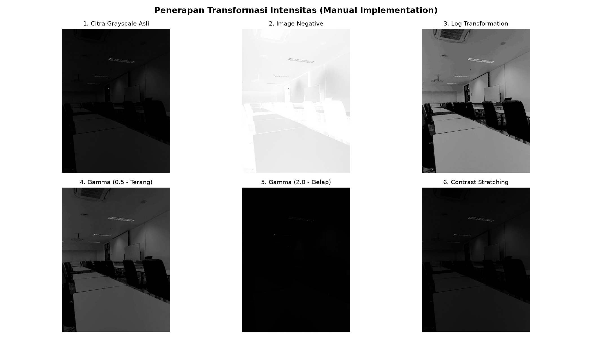
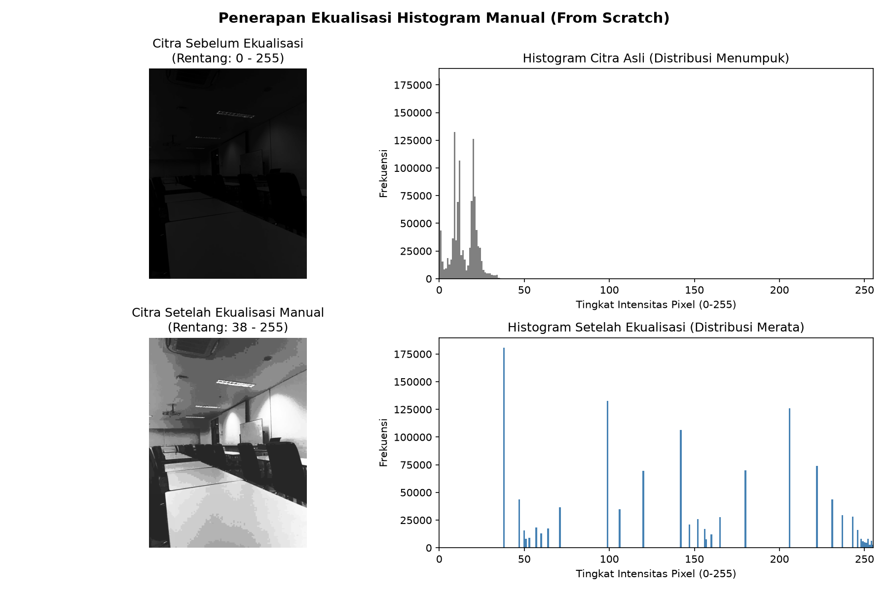

# Laporan Tugas 2: Transformasi Intensitas dan Ekualisasi Histogram

Mata Kuliah: **Praktikum Pengolahan Citra dan Visi Komputer (PCV)**  
Berkas Program: [`2-ti-eq.py`](2-ti-eq.py)

---

## 📌 Ketentuan Khusus
> [!IMPORTANT]
> **Aturan Wajib:** Seluruh algoritma transformasi intensitas dan ekualisasi histogram pada tugas ini diimplementasikan **secara mandiri (from scratch / manual)** dengan rumus matematika dasar. **Dilarang menggunakan fungsi bawaan package** seperti `cv2.equalizeHist`, `cv2.LUT`, fungsi exposure bawaan `scikit-image`, maupun pustaka sejenis.

---

## 🧠 Dasar Teori & Rumus Matematis

### 1. Transformasi Intensitas (Spatial Domain)
Transformasi intensitas beroperasi langsung pada nilai piksel tunggal $r \in [0, 255]$ untuk menghasilkan piksel keluaran $s \in [0, 255]$:

1. **Citra Negatif (*Image Negative*):**
   $$s = (L - 1) - r = 255 - r$$
   Membalik tingkat keabuan citra, sangat efektif menonjolkan detail terang yang terbenam di latar belakang gelap.

2. **Transformasi Logaritmik (*Log Transformation*):**
   $$s = c \cdot \log(1 + r) \quad \text{dengan} \quad c = \frac{255}{\log(1 + \max(r))}$$
   Memperlebar rentang dinamis piksel bernilai rendah (gelap) dan memampatkan piksel bernilai tinggi (terang).

3. **Transformasi Pangkat / Gamma (*Power-Law / Gamma Transformation*):**
   $$s = 255 \cdot \left(\frac{r}{255}\right)^\gamma$$
   - Nilai $\gamma < 1$ (misal $\gamma = 0.5$): Menerangkan area gelap tanpa menghilangkan detail terang secara drastis.
   - Nilai $\gamma > 1$ (misal $\gamma = 2.0$): Menggelapkan area terang dan meningkatkan kontras bayangan.

4. **Peregangan Kontras (*Contrast Stretching*):**
   $$s = \left(\frac{r - r_{min}}{r_{max} - r_{min}}\right) \times 255$$
   Meregangkan rentang intensitas citra yang sempit $[r_{min}, r_{max}]$ ke rentang penuh $[0, 255]$.

5. **Pengambangan Biner (*Binary Thresholding*):**
   $$s = \begin{cases} 255, & \text{jika } r \ge T \\ 0, & \text{jika } r < T \end{cases}$$

---

### 2. Ekualisasi Histogram Manual (From Scratch)
Tahapan perhitungan algoritma ekualisasi histogram manual:
1. **Hitung Frekuensi Piksel:** Menghitung jumlah kemunculan $n_k$ untuk setiap tingkat keabuan $k \in [0, 255]$ menggunakan iterasi larik (tanpa `cv2.calcHist`).
2. **Hitung CDF (*Cumulative Distribution Function*):**
   $$CDF(k) = \sum_{j=0}^{k} \frac{n_j}{M \times N}$$
   di mana $M \times N$ adalah jumlah total piksel pada citra.
3. **Penyusunan Tabel Pemetaan Intensitas Baru (*Look-Up Table*):**
   $$s_k = \text{round}(CDF(k) \times 255)$$
4. **Pemetaan Piksel:** Setiap piksel $r$ pada citra asli digantikan dengan nilai barunya $s_k$ sesuai indeks tabel pemetaan.

---

## 🔬 Hasil Eksperimen

### 1. Citra Masukan Ruangan Gelap (Input)
Citra yang digunakan adalah foto ruangan nyata dalam kondisi gelap (*underexposed / low-light room*, resolusi $960 \times 1280$ piksel) dengan rata-rata intensitas sangat rendah ($\approx 12.6$ dari skala $255$):


---

### 2. Visualisasi Transformasi Intensitas
Hasil perbandingan 6 mode transformasi intensitas yang dihitung secara manual:



> **Analisis Transformasi Intensitas pada Ruangan Gelap:**
> - **Log Transformation & Gamma ($\gamma = 0.5$):** Sangat efektif mengangkat intensitas piksel-piksel gelap sehingga objek di dalam ruangan yang tadinya tidak terlihat mulai tampak jelas.
> - **Gamma ($\gamma = 2.0$):** Mempertegas area gelap/bayangan, membuat area yang minim cahaya semakin pekat.
> - **Image Negative:** Membalik nilai piksel ($255 - r$), mengubah latar belakang yang gelap gulita menjadi terang sehingga kontur objek tampak seperti citra rontgen.
> - **Contrast Stretching:** Meregangkan rentang dinamis intensitas piksel ke seluruh rentang $0 - 255$.

---

### 3. Visualisasi Ekualisasi Histogram Manual
Perbandingan antara citra sebelum vs sesudah ekualisasi beserta grafik distribusi frekuensi histogramnya:



> **Analisis Grafik Histogram:**
> - **Sebelum Ekualisasi (Histogram Abu-abu):** Distribusi frekuensi piksel menumpuk ekstrem di area paling kiri (intensitas mendekati 0, gelap gulita). Mata manusia hampir tidak dapat membedakan objek di dalam ruangan karena minimnya perbedaan kontras antarpiksel.
> - **Setelah Ekualisasi Manual (Histogram Biru):** Melalui perhitungan fungsi distribusi kumulatif (CDF) manual, probabilitas intensitas dipetakan ulang dan diratakan ke seluruh rentang dinamis $0 - 255$.
> - **Dampak Visual:** Objek, kontur dinding, dan perabotan yang semula tersembunyi dalam kegelapan langsung terungkap dengan jelas dan tegas tanpa menggunakan fungsi bawaan `cv2.equalizeHist`.

---

## 💻 Cara Menjalankan Berkas
Masuk ke direktori tugas ini lalu jalankan:
```bash
python 2-ti-eq.py
```
Seluruh kalkulasi dilakukan secara otomatis dan visualisasi grafik akan langsung tersimpan ke berkas gambar PNG di folder ini.
