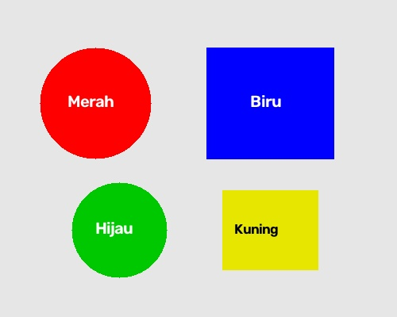
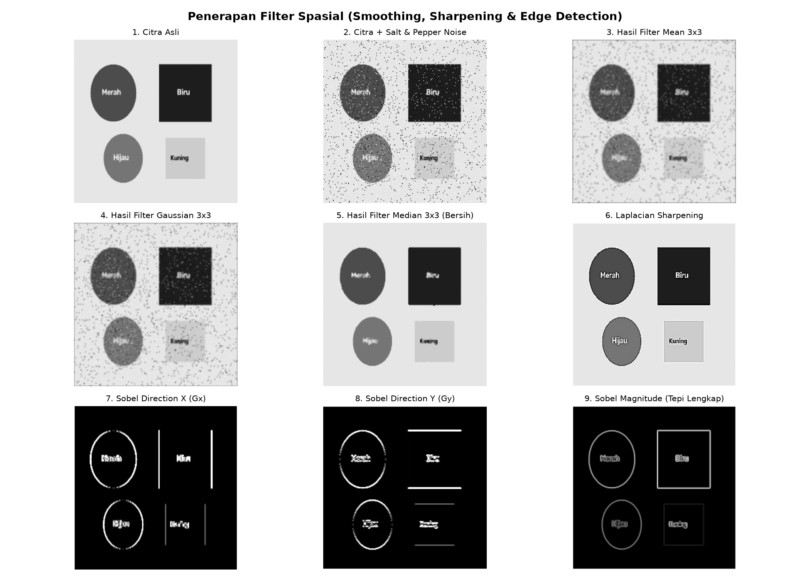

# Laporan Tugas 3: Penerapan Filter Spasial (Spatial Filtering)

Mata Kuliah: Praktikum Pengolahan Citra dan Visi Komputer (PCV)  
Berkas Program: [`3-filter-spasial.py`](3-filter-spasial.py)

---

## Ringkasan Tugas dan Pendekatan Implementasi

Filter spasial memproses piksel citra secara langsung berdasarkan nilai intensitas piksel tetangga melalui operasi konvolusi 2D atau pengurutan statistik lokal.

### Pemisahan Intensitas dan Restorasi Warna Asli
Penerapan filter spasial secara terpisah pada masing-masing kanal warna RGB dapat memicu pergeseran rona (*color shift*) atau perubahan saturasi warna. Untuk menghindari degradasi warna tersebut, digunakan pendekatan berbasis ruang warna HSV:
1. **Pemisahan Kanal:** Citra BGR dikonversi ke HSV untuk memisahkan informasi kromatisitas ($H$ dan $S$) dari komponen intensitas kecerahan monokrom ($V$).
2. **Pemrosesan pada Intensitas Monokrom:** Operasi konvolusi spasial (Mean, Gaussian, Median, dan Laplacian) diterapkan secara eksklusif pada kanal $V$.
3. **Restorasi Warna:** Kanal $V$ yang telah difilter digabungkan kembali dengan kanal $H$ dan $S$ asli, kemudian dikonversi kembali ke BGR.
4. **Hasil:** Citra keluaran memperoleh efek penghalusan atau penajaman pada intensitas luminansi dengan rona dan saturasi warna asli yang tetap terjaga utuh.

---

## Dasar Teori dan Matriks Kernel

### 1. Konvolusi 2D Spasial
Operasi konvolusi diskret menggeser matriks kernel bobot $w$ berukuran $m \times n$ di atas bidang citra $f(x,y)$:
$$g(x,y) = \sum_{s=-a}^a \sum_{t=-b}^b w(s,t) \cdot f(x+s, y+t)$$
Batas tepi citra ditangani dengan teknik penambahan bantalan (*padding*) agar ukuran citra keluaran identik dengan citra masukan.

---

### 2. Matriks Kernel yang Digunakan

* **Mean Filter ($3\times3$):**
  $$W_{mean} = \frac{1}{9}\begin{bmatrix} 1 & 1 & 1 \\ 1 & 1 & 1 \\ 1 & 1 & 1 \end{bmatrix}$$

* **Gaussian Filter ($3\times3$):**
  $$W_{gauss} = \frac{1}{16}\begin{bmatrix} 1 & 2 & 1 \\ 2 & 4 & 2 \\ 1 & 2 & 1 \end{bmatrix}$$

* **Median Filter ($3\times3$):**
  Mengambil 9 nilai intensitas pada jendela lingkungan, mengurutkannya secara menaik, lalu menetapkan nilai median (elemen ke-5) sebagai intensitas baru. Filter non-linier ini efektif mereduksi derau impulsif (*salt-and-pepper*) tanpa mengaburkan ketajaman tepi secara berlebih.

* **Laplacian Sharpening Kernel ($3\times3$):**
  $$W_{laplacian} = \begin{bmatrix} 0 & -1 & 0 \\ -1 & 5 & -1 \\ 0 & -1 & 0 \end{bmatrix}$$
  Kernel ini menjumlahkan turunan kedua Laplacian dengan citra asli pada pusat piksel, mempertegas transisi intensitas tinggi pada tepi objek.

* **Operator Sobel (Deteksi Tepi):**
  $$G_x = \begin{bmatrix} -1 & 0 & 1 \\ -2 & 0 & 2 \\ -1 & 0 & 1 \end{bmatrix}, \quad G_y = \begin{bmatrix} -1 & -2 & -1 \\ 0 & 0 & 0 \\ 1 & 2 & 1 \end{bmatrix}$$
  Magnitudo gradien tepi dihitung dengan rumus:
  $$|G| = \sqrt{G_x^2 + G_y^2}$$

---

## Hasil Eksperimen

### 1. Citra Masukan
Citra sampel berwarna yang digunakan dalam pengujian:



---

### 2. Komparasi Filter Spasial (9 Panel)
Grafik komparasi 9 panel menampilkan hasil evaluasi seluruh filter spasial:



Analisis hasil eksperimen:
1. **Penghalusan dan Penajaman dengan Restorasi Warna:**
   - **Mean & Gaussian Filter:** Menghaluskan variasi frekuensi tinggi pada citra. Gaussian filter mempertahankan transisi batas yang lebih wajar dibandingkan perataan seragam Mean filter.
   - **Median Filter:** Mengeliminasi derau impulsif bintik putih dan hitam seraya mempertahankan batas tepi dan warna objek asli.
   - **Laplacian Sharpening:** Meningkatkan kontras lokal pada garis tepi dan tekstur objek tanpa merusak konsistensi warna.
2. **Deteksi Tepi Sobel ($G_x$, $G_y$, Magnitudo):**
   - $G_x$ merespons gradien intensitas arah horizontal (menonjolkan garis tepi vertikal).
   - $G_y$ merespons gradien intensitas arah vertikal (menonjolkan garis tepi horizontal).
   - Magnitudo gradien menggabungkan kedua komponen menjadi representasi batas tepi objek secara menyeluruh.

---

## Panduan Menjalankan Program

Jalankan perintah berikut di terminal:
```bash
python 3-filter-spasial/3-filter-spasial.py
```
Grafik perbandingan 9 panel akan ditampilkan di layar dan tersimpan sebagai `hasil_filter_spasial.png`.
