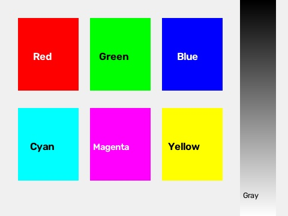
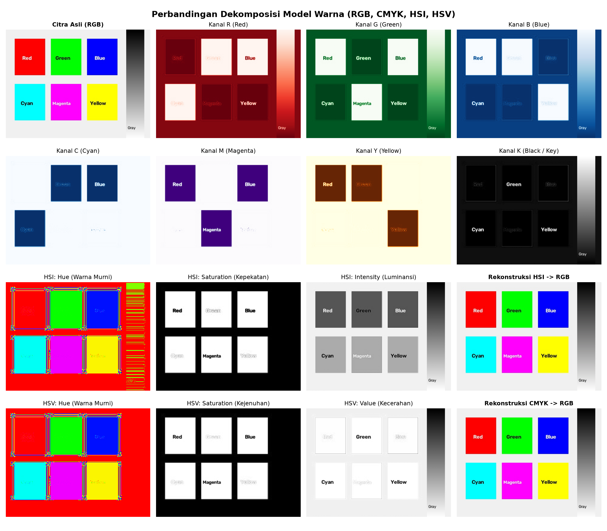

# Laporan Tugas 4: Konversi Model Warna (RGB, CMYK, HSI, HSV)

Mata Kuliah: **Praktikum Pengolahan Citra dan Visi Komputer (PCV)**  
Berkas Program: [`4-model-warna.py`](4-model-warna.py)

---

## 📌 Ringkasan Tugas
Pada tugas ini dilakukan eksplorasi dan perbandingan representasi citra pada empat model ruang warna utama:
1. **RGB (Red, Green, Blue)**: Model warna aditif berbasis perangkat display (layar monitor).
2. **CMYK (Cyan, Magenta, Yellow, Key/Black)**: Model warna subtraktif standar industri percetakan.
3. **HSI (Hue, Saturation, Intensity)**: Model yang menirukan sistem persepsi penglihatan visual manusia.
4. **HSV (Hue, Saturation, Value)**: Model heksagonal/silinder yang memisahkan pigmen warna dari kecerahan.

---

## 🧠 Dasar Teori & Perumusan Matematis

### 1. Model Warna CMYK (Subtraktif)
Dari nilai RGB ternormalisasi ke $[0, 1]$:
- **Kanal K (Black / Key):**
  $$K = 1 - \max(R, G, B)$$
- **Kanal Cyan ($C$), Magenta ($M$), dan Yellow ($Y$):**
  $$C = \frac{1 - R - K}{1 - K}, \quad M = \frac{1 - G - K}{1 - K}, \quad Y = \frac{1 - B - K}{1 - K}$$
  *(Jika $K = 1$, maka $C = M = Y = 0$)*
- **Rekonstruksi CMYK $\rightarrow$ RGB:**
  $$R = 255 \times (1 - C) \times (1 - K)$$
  $$G = 255 \times (1 - M) \times (1 - K)$$
  $$B = 255 \times (1 - Y) \times (1 - K)$$

---

### 2. Model Warna HSI (Human Perception)
Berdasarkan formulasi buku teks *Digital Image Processing (Gonzalez & Woods)*:
- **Intensitas ($I$):**
  $$I = \frac{R + G + B}{3}$$
- **Saturasi ($S$):**
  $$S = 1 - \frac{3}{R + G + B} \min(R, G, B) \quad (\text{bila } R+G+B = 0 \Rightarrow S = 0)$$
- **Hue ($H$):**
  $$\theta = \arccos\left(\frac{\frac{1}{2}[(R - G) + (R - B)]}{\sqrt{(R - G)^2 + (R - B)(G - B)}}\right)$$
  $$H = \begin{cases} \theta, & \text{jika } B \le G \\ 360^\circ - \theta, & \text{jika } B > G \end{cases}$$

---

### 3. Model Warna HSV (Hexcone Model)
- **Value ($V$):** $V = \max(R, G, B)$
- **Saturation ($S$):** $S = \frac{V - \min(R, G, B)}{V}$ *(jika $V = 0 \Rightarrow S = 0$)*
- **Hue ($H$):** Menghitung sudut rotasi warna berdasarkan kanal yang bernilai maksimum.

---

## 🔬 Hasil Eksperimen

### 1. Citra Masukan (Input)
Citra sampel aneka warna spektrum yang digunakan pada pengujian:



---

### 2. Hasil Visualisasi Dekomposisi Kanal (16 Panel)
Grafik komparatif perbandingan dekomposisi antarkanal untuk seluruh model warna beserta hasil rekonstruksinya:



> **Analisis Dekomposisi:**
> 1. **RGB (Baris 1):** Objek merah memiliki intensitas tertinggi pada kanal R, objek hijau pada kanal G, dan objek biru pada kanal B.
> 2. **CMYK (Baris 2):** Warna subtraktif berkebalikan dengan aditif. Warna merah murni menyerap Cyan (kanal C bernilai rendah/hitam), sedangkan Cyan memiliki nilai C maksimal.
> 3. **HSI (Baris 3):** Memisahkan informasi kromatisitas ($H$ dan $S$) dari kecerahan rata-rata ($I$). Hasil rekonstruksi $HSI \rightarrow RGB$ berhasil mengembalikan warna asli secara sempurna tanpa distorsi.
> 4. **HSV (Baris 4):** Mirip dengan HSI namun menggunakan nilai intensitas tertinggi ($V = \max$), sangat stabil untuk segmentasi warna.

---

## 💻 Cara Menjalankan Berkas
Masuk ke direktori tugas ini lalu jalankan:
```bash
python 4-model-warna.py
```
Seluruh kalkulasi dan grafik komparasi 16 panel akan langsung tersimpan ke berkas `hasil_model_warna.png`.
