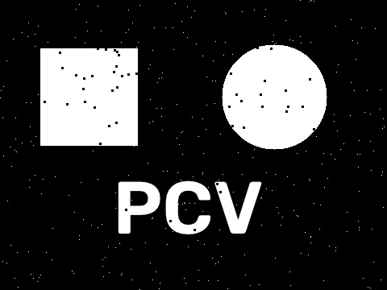
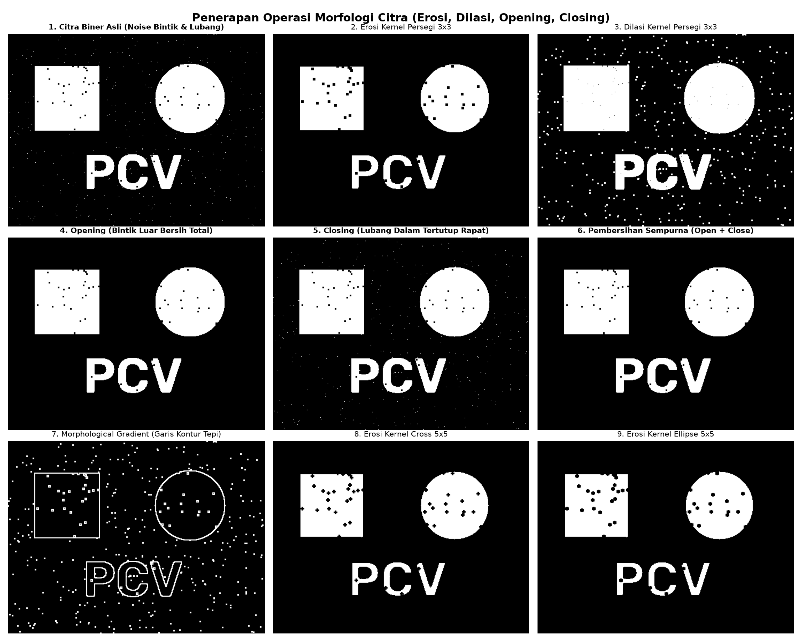

# Laporan Tugas 5: Operasi Morfologi Citra (Erosi, Dilasi, Opening, Closing)

Mata Kuliah: Praktikum Pengolahan Citra dan Visi Komputer (PCV)  
Berkas Program: [`5-morphology.py`](5-morphology.py)

---

## Ringkasan Tugas

Morfologi matematika adalah kerangka pemrosesan citra berbasis teori himpunan yang menganalisis struktur geometris objek biner menggunakan matriks referensi yang disebut *Structuring Element* (SE):
1. **Erosi (Erosion):** Mengikis batas luar objek biner, memperkecil area putih, dan mengeliminasi tonjolan kecil di luar objek.
2. **Dilasi (Dilation):** Memperluas batas objek, memperbesar area putih, dan menutup celah sempit atau lubang kecil di dalam objek.
3. **Opening:** Operasi erosi yang diikuti oleh dilasi. Berfungsi mengeliminasi derau bintik putih di latar belakang tanpa mengubah skala dimensi utama objek.
4. **Closing:** Operasi dilasi yang diikuti oleh erosi. Berfungsi menutup lubang atau rongga hitam di dalam objek serta menyambungkan segmen yang terputus.
5. **Morphological Gradient:** Selisih antara hasil dilasi dan erosi, menghasilkan kontur batas tepi objek.

---

## Dasar Teori dan Notasi Matematika

Diberikan citra biner $A$ dan *Structuring Element* $B$:

* **Erosi ($A \ominus B$):**
  $$A \ominus B = \{z \mid (B)_z \subseteq A\}$$
  Pusat elemen penstruktur bernilai 1 hanya jika seluruh elemen $B$ termuat sepenuhnya di dalam himpunan objek $A$.

* **Dilasi ($A \oplus B$):**
  $$A \oplus B = \{z \mid (\hat{B})_z \cap A \ne \emptyset\}$$
  Pusat elemen penstruktur bernilai 1 jika minimal terdapat satu elemen refleksi $\hat{B}$ yang beririsan dengan objek $A$.

* **Opening ($A \circ B$):**
  $$A \circ B = (A \ominus B) \oplus B$$

* **Closing ($A \bullet B$):**
  $$A \bullet B = (A \oplus B) \ominus B$$

* **Morphological Gradient ($G(A)$):**
  $$G(A) = (A \oplus B) - (A \ominus B)$$

---

## Hasil Eksperimen

### 1. Citra Masukan Biner Berderau
Citra masukan memuat teks "PCV" dan bentuk geometris biner yang mengandung derau impulsif bintik putih di latar belakang (*salt*) serta rongga lubang hitam di dalam objek (*pepper*):



---

### 2. Evaluasi Morfologi (9 Panel)
Grafik perbandingan 9 panel menunjukkan efek filtering morfologi terhadap pemulihan bentuk objek:



Analisis hasil eksperimen:
1. **Erosi (Panel 2, 8, dan 9):**
   - Mengikis batas objek sehingga garis teks dan bentuk geometris menipis.
   - Bintik putih di latar belakang tereliminasi, namun rongga hitam di dalam objek bertambah lebar.
2. **Dilasi (Panel 3):**
   - Menutup rongga hitam di dalam objek dan mempertebal garis bentuk, namun bintik putih di latar belakang ikut membesar.
3. **Opening (Panel 4):**
   - Mereduksi bintik derau putih di luar objek sementara ketebalan dan bentuk dasar objek utama tetap terjaga.
4. **Closing (Panel 5):**
   - Mengisi dan menutup rongga hitam di dalam objek sehingga permukaan biner menjadi homogen dan solid.
5. **Kombinasi Opening lalu Closing (Panel 6):**
   - Mengeliminasi derau luar sekaligus memulihkan rongga di dalam objek secara simultan.
6. **Morphological Gradient (Panel 7):**
   - Menghasilkan profil garis tepi tertutup di sepanjang batas luar dan rongga dalam objek dengan lebar garis yang seragam.

---

## Panduan Menjalankan Program

Jalankan perintah berikut di terminal:
```bash
python 5-morphology/5-morphology.py
```
Kalkulasi morfologi akan dijalankan dan visualisasi 9 panel disimpan ke `hasil_morfologi.png`.
